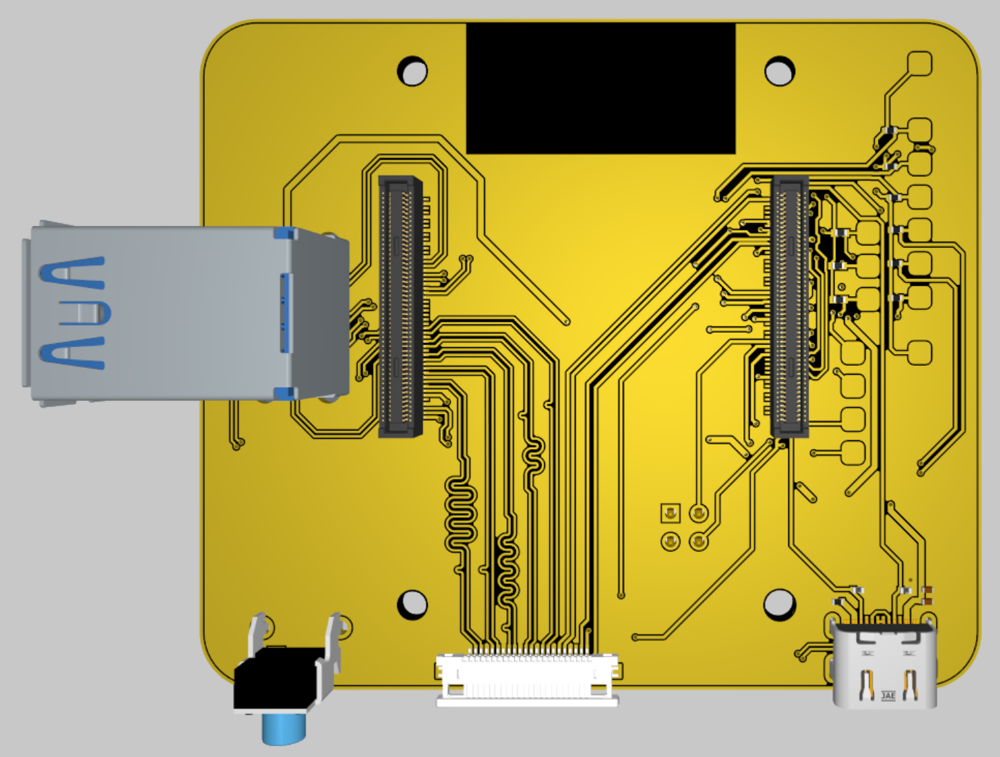
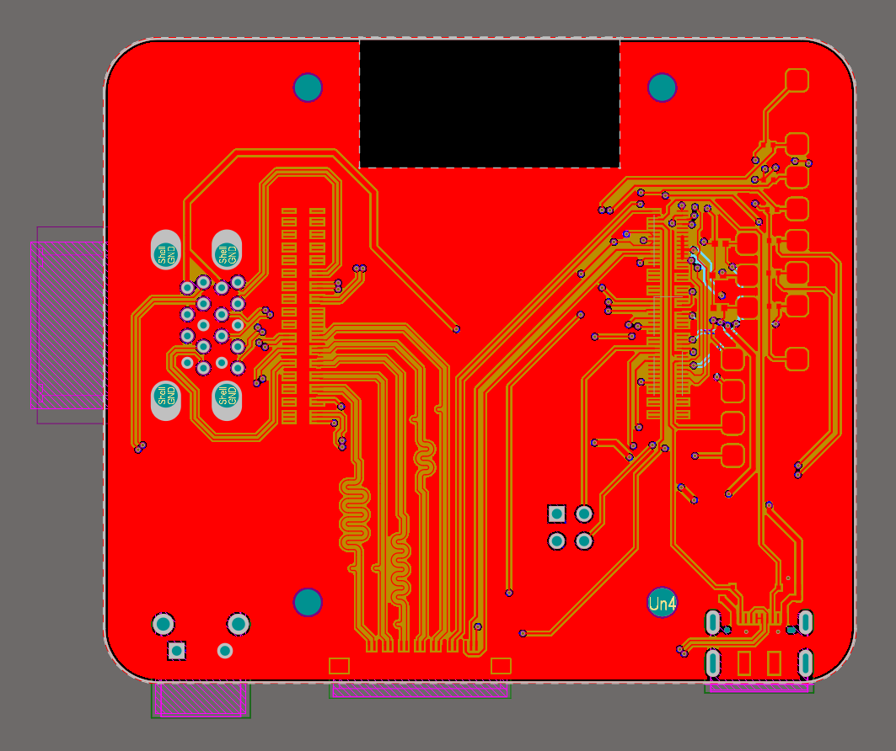
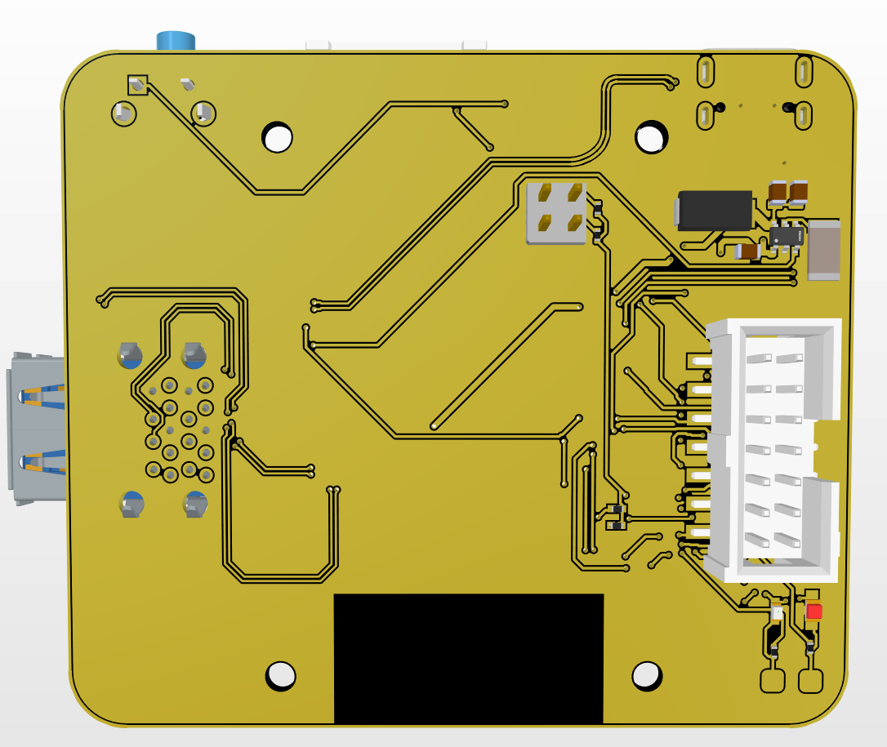

<div align="center">

# CM5IO IARC

### Custom Raspberry Pi Compute Module 5 Carrier Board

Developed for **Team Arrow** as part of the
**International Aerial Robotics Competition (IARC) Mission 10**



</div>

---

# About The Project

CM5IO IARC is a custom carrier board for the Raspberry Pi Compute Module 5 designed in Altium Designer for Team Arrow.

This board was developed for the International Aerial Robotics Competition (IARC) Mission 10 for integration into autonomous aerial systems and robotics platforms.

The main goal of the project was to create a compact and flexible CM5-based embedded platform suitable for UAV and robotics applications while improving integration compared to standard development boards.

Some of the primary design goals were:

* compact PCB layout
* clean high-speed routing
* GPIO and peripheral expansion
* easier integration into custom robotics systems
* reliable power interfacing
* practical embedded system deployment

The board was designed while learning and improving high-speed PCB design practices, signal routing, and embedded hardware integration.

---

# Board Renders

## PCB Routing

<div align="center">

</div>

---

## Front Side

<div align="center">

</div>

---

## Back Side

<div align="center">

</div>

---

# Current Features

* Raspberry Pi Compute Module 5 support
* GPIO breakout interfaces
* USB connectivity
* Compact PCB footprint
* High-speed routed signals
* Power regulation circuitry
* Peripheral expansion support
* Robotics-oriented architecture

---

# Hardware Details

| Item                | Details                       |
| ------------------- | ----------------------------- |
| Main Module         | Raspberry Pi Compute Module 5 |
| PCB Software        | Altium Designer               |
| PCB Layers          | 4                             |
| Interfaces          | GPIO, USB, UART, SPI, I2C     |
| Primary Application | Robotics / UAV Systems        |
| Competition         | IARC Mission 10               |

---

# Repository Structure

```text
Hardware/
├── PCB/
├── Schematics/
└── Project/

Images/

Manufacturing/
├── Gerbers/
├── BOM/
└── PickAndPlace/
```

---

# Development Status

Current board revision is still under development and testing.

Planned future improvements include:

* improved EMI optimization
* cleaner differential routing
* additional interface support
* prototype validation
* manufacturing iteration improvements

---

# Why This Project Was Open Sourced

This repository was made public to document the hardware development process and help others working on CM5-based embedded systems, robotics, and PCB design.

A lot of student and robotics hardware projects never publish their design files, which makes learning and collaboration unnecessarily difficult.

---

# Software Used

* Altium Designer

---

# Team

Developed by:

* Rudra Navdiya
* Het Patel
* Dhyan Patel

### Team Arrow

Nirma University

For the International Aerial Robotics Competition (IARC) Mission 10.

---

# License

This project is licensed under the MIT License.
